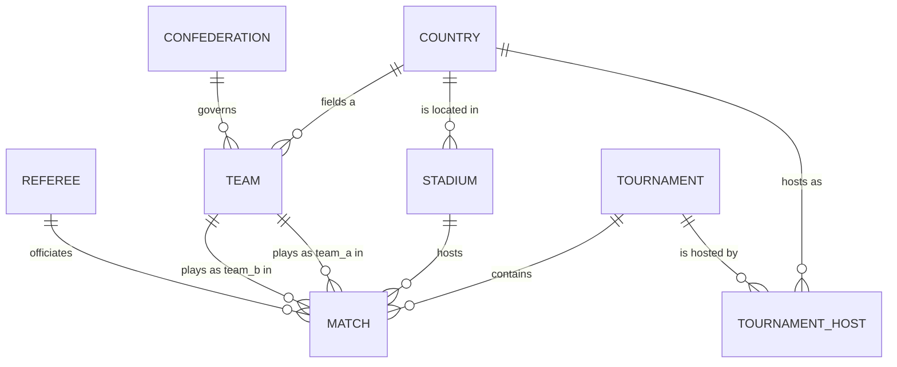

# world-cup-data

[](https://github.com/pawelMSoftware/world-cup-data/actions/workflows/tests.yml)
[](LICENSE)

A normalized, relational dataset of FIFA World Cup tournaments, teams, stadiums, and matches from
2002 to 2026, rebuilt from [OpenFootball](https://github.com/openfootball/worldcup.json) and
verified against official FIFA competition data.

## Overview

Public World Cup data typically comes as one flat file per tournament, with teams and stadiums
repeated as plain strings on every match and no stable identifier for anything. That's fine for
reading one tournament's fixture list by hand; it breaks down the moment you want to ask a question
that spans tournaments — "how many times have these two teams met", "which stadiums has this country
hosted at", "what's this match's permanent ID" — without re-parsing and re-matching strings each time.

This repository restructures the same underlying facts into eight linked entities (countries,
confederations, teams, stadiums, tournaments, tournament hosts, matches, referees), each with a permanent UUID
and explicit foreign keys, plus an automated test suite that keeps every relationship, sort order,
and formatting rule enforced going forward. Data quality is not a one-time claim — every match has
been checked against official FIFA competition data, with the full results published in
[`docs/DATASET_AUDIT.md`](docs/DATASET_AUDIT.md).

## Repository purpose

- Provide World Cup data in a shape suitable for direct use in an application or database — load a
  JSON file, get typed, cross-referenced records with no string-matching required.
- Separate the concept of a "team" from a "country" (England, Scotland, and Wales are three teams
  sharing one country), and preserve historical entities (`Serbia and Montenegro`) instead of
  merging them into their modern successor.
- Make every naming and formatting decision explicit and documented, instead of leaving a consumer to
  guess why `AWD-Arena` doesn't match today's stadium name (see
  [`docs/CONVENTIONS.md`](docs/CONVENTIONS.md)).
- Independently verify the data against a second, authoritative source (FIFA) and publish the
  results, rather than assuming the primary source is error-free.

## Features

- **Eight normalized entities** — countries, confederations, teams, stadiums, tournaments, tournament
  hosts, matches, and referees — linked exclusively by
  [UUID v7](https://www.rfc-editor.org/rfc/rfc9562#name-uuid-version-7) foreign keys.
- **Team/country separation** — a national football team and a sovereign country are different
  concepts in this model, not conflated.
- **Confederation membership** — every team is linked to its FIFA confederation (AFC, CAF, CONCACAF,
  CONMEBOL, OFC, UEFA), sourced from FIFA's own team API, not guessed from geography.
- **Historical accuracy** — stadium names reflect what they were called at tournament time, not
  their current sponsor name; dissolved countries are kept, not merged into their successor.
- **FIFA-verified kickoff times** — every `kickoff_at` is sourced from official FIFA competition
  data, converted to UTC, not derived from local time.
- **Published audit trail** — every match cross-checked against FIFA, with a full report of what
  matched, what didn't, and why (see [`docs/DATASET_AUDIT.md`](docs/DATASET_AUDIT.md)).
- **Automated validation** — a Pest test suite enforces referential integrity, uniqueness, sort
  order, and formatting on every dataset.

## Supported tournaments

| Year | Host(s) | Matches |
|---|---|---:|
| 2002 | Japan, South Korea | 64 |
| 2006 | Germany | 64 |
| 2010 | South Africa | 64 |
| 2014 | Brazil | 64 |
| 2018 | Russia | 64 |
| 2022 | Qatar | 64 |
| 2026 | Canada, Mexico, United States | 104 |

All seven tournaments in scope (2002–2026) are complete: every match has been played and every
record is present. See [Missing data](docs/DATASET_AUDIT.md#missing-data) in the dataset audit.

## Repository structure

```text
data/
├── countries.json           # 70 countries
├── confederations.json      # 6 FIFA confederations
├── teams.json                # 72 national teams
├── stadiums.json             # 90 stadiums
├── tournaments.json          # 7 tournaments
├── tournament_hosts.json     # 10 tournament/host-country pairs
├── referees.json             # 147 unique referees, linked from matches via referee_id
└── matches/
    └── {year}.json           # 488 matches total, one file per tournament

docs/
├── ARCHITECTURE.md           # how the pipeline works
├── DATA_MODEL.md             # entities, fields, relationships
├── DATA_SOURCES.md           # what each source is used for, and why
├── CONVENTIONS.md            # formatting and naming rules
├── DATASET_AUDIT.md          # FIFA verification results
├── CONTRIBUTING.md           # contributor workflow
└── CHANGELOG.md              # release history

tests/
├── *Test.php                 # one Pest test file per dataset
├── Helpers.php                # shared loaders and assertions
└── fixtures/                  # committed reference data used by tests (e.g. FIFA kickoff snapshot)

.github/
├── workflows/
│   └── tests.yml              # runs `composer test` on every push and pull request
├── ISSUE_TEMPLATE/            # data-correction and bug-report issue forms
└── PULL_REQUEST_TEMPLATE.md   # PR checklist matching CONTRIBUTING.md
```

## Data model overview



Every reference between files is a UUID v7 foreign key — never a name, code, or other natural key.
Full field-by-field documentation, including why each entity exists and why it's shaped the way it
is, is in [`docs/DATA_MODEL.md`](docs/DATA_MODEL.md).

## Dataset statistics

| Dataset | Records |
|---|---:|
| Countries | 70 |
| Confederations | 6 |
| Teams | 72 |
| Stadiums | 90 |
| Tournaments | 7 |
| Tournament hosts | 10 |
| Matches | 488 |
| Referees | 147 |

## Data sources

| Role | Source | Used for |
|---|---|---|
| Primary | [OpenFootball](https://github.com/openfootball/worldcup.json) (`master` branch) | Everything except kickoff timestamps and attendance: team pairings, scores, stages, groups, stadium/city names, tournament identity. |
| Authoritative for kickoff time and confederation | [FIFA competition API](https://api.fifa.com) | `kickoff_at` (wins outright if it disagrees with OpenFootball's local time) and `teams.json`'s `confederation_id` (OpenFootball has no confederation data at all). |
| Metadata gap-filling | Wikidata, then Wikipedia | Stadium coordinates for 2002–2022 only, because OpenFootball has none for those years. |
| Match attendance | FIFA, RSSSF, then Wikipedia (priority varies by tournament) | `matches[].attendance`, since OpenFootball carries no attendance data at all. See [`docs/attendance-match-mapping.md`](docs/attendance-match-mapping.md) for the full per-match sourcing. |

Outside of these documented roles, no other third-party source (news sites, other football
databases, search results) is used anywhere in this project. Full rationale for each source, and
exactly what it is and isn't trusted for, is in [`docs/DATA_SOURCES.md`](docs/DATA_SOURCES.md).

## Verification strategy

Every one of the 488 matches was independently compared against official FIFA competition data —
teams, stadium, kickoff time, stage, and score — and the full results are published in
[`docs/DATASET_AUDIT.md`](docs/DATASET_AUDIT.md), not just summarized:

- **0 confirmed data errors.** One was found (`2022-046` had the wrong stadium) and has been
  corrected.
- **229 warnings**, every one individually classified into one of five causes (sponsor-name changes,
  historical naming, city renaming/transliteration, differing administrative granularity, or FIFA's
  own neutral in-tournament branding) and confirmed to refer to the same real-world stadium or city
  in every case — none indicate incorrect data.
- **Final assessment: PASS WITH WARNINGS — release-ready.**

Verification is read-only: it produces a report, never a silent data change. Any correction it
recommends is applied as its own separately-reviewed edit, as `2022-046`'s fix was.

## Testing

The dataset is validated by a [Pest](https://pestphp.com) test suite (plain PHP 8.5, no Laravel
dependency). Run it with:

```bash
composer install
composer test
```

Every dataset has its own test file (`tests/CountriesTest.php`, `tests/TeamsTest.php`, etc.) checking
JSON validity, required fields and field order, UUID v7 format and uniqueness, natural-key uniqueness
(`iso2`, `fifa_code`, stadium `code`, match `code`), referential integrity across every foreign key,
sort order, and dataset-specific rules such as "penalties cannot exist without extra time" or
"every match's `kickoff_at` matches the committed FIFA snapshot". See
[`docs/CONTRIBUTING.md`](docs/CONTRIBUTING.md#testing) for what's expected of new tests.

A GitHub Actions workflow (`.github/workflows/tests.yml`) runs `composer test` on every push and
pull request.

## Versioning

This project follows [Semantic Versioning](https://semver.org/) for both its schema and its dataset
content. A breaking change to a dataset's field names, types, or relationships is a major version
bump; adding a tournament or correcting data is a minor or patch release. See
[`docs/CHANGELOG.md`](docs/CHANGELOG.md) for the full history, starting at `v1.0.0`.

## Future roadmap

- Extend coverage to earlier World Cups (pre-2002), following the same pipeline in
  [`docs/ARCHITECTURE.md`](docs/ARCHITECTURE.md).
- Consider storing FIFA's alternate stadium/city labels as supplementary metadata, purely for
  cross-reference, without changing the primary `name`/`city` values (see the Recommendations in
  [`docs/DATASET_AUDIT.md`](docs/DATASET_AUDIT.md)).

## License

MIT — see [`LICENSE`](LICENSE).

## Acknowledgements

- [OpenFootball](https://github.com/openfootball/worldcup.json) for maintaining an open, structured
  World Cup dataset spanning every tournament in scope.
- FIFA, whose public competition API made independent verification of this dataset possible.
