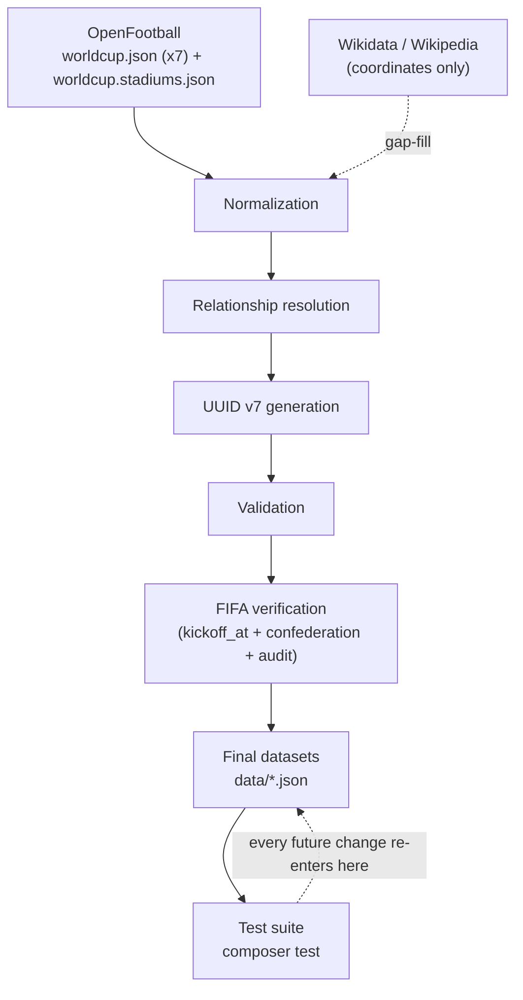

# Architecture

This document describes how the datasets in `data/` were produced and how they are kept correct.
There is no application code in this repository — the "architecture" is a data pipeline that was run
once per dataset, plus a permanent validation layer (the test suite) that keeps the output honest
going forward.

## Pipeline



### 1. OpenFootball

Seven `worldcup.json` files (one per tournament, 2002–2026) plus one `worldcup.stadiums.json`
(2026 only) are read from the `master` branch of
[openfootball/worldcup.json](https://github.com/openfootball/worldcup.json). This is the only input
with team pairings, scores, stages, groups, and stadium/city names. See
[DATA_SOURCES.md](DATA_SOURCES.md) for the full source policy.

### 2. Normalization

Raw OpenFootball strings are mapped onto a fixed vocabulary:

- Team name variants (`USA`, `Côte d'Ivoire` / `Ivory Coast`, `Bosnia-Herzegovina` /
  `Bosnia & Herzegovina`) collapse onto one canonical team.
- Country `name` (common) and `official_name` (official) are separated — see
  [CONVENTIONS.md](CONVENTIONS.md#team-and-country-naming).
- Inconsistent round labels (`"Quarterfinals"`, `"Quarter-finals"`, `"Quarter-final"`, …) collapse
  onto the fixed `stage` enum.
- Stadium names are kept as their tournament-time value rather than normalized to a current name —
  see [CONVENTIONS.md](CONVENTIONS.md#stadium-naming-policy).

Where OpenFootball has no value at all for a required field — stadium coordinates for 2002–2022 —
Wikidata, then Wikipedia, is consulted as a gap-filler. This is the only point in the pipeline where
either of those sources is used; see [DATA_SOURCES.md](DATA_SOURCES.md).

### 3. Relationship resolution

Every plain-text reference in the normalized data (a team name on a match, a city on a stadium, a
host country implied by a stadium's location) is resolved to the UUID of the corresponding record in
`countries.json`, `teams.json`, `stadiums.json`, or `tournaments.json`. After this step, no dataset
contains a string reference to another entity — only UUID foreign keys.

### 4. UUID v7 generation

Each record is assigned a UUID v7 exactly once. IDs are never regenerated once assigned, including
when a later step corrects an unrelated field on the same record — see
[DATA_MODEL.md](DATA_MODEL.md#uuid-usage).

### 5. Validation

Structural checks run immediately after generation, before anything is written: referential
integrity (does every foreign key resolve?), uniqueness (UUIDs, natural keys like `fifa_code` and
`code`), sort order, and business rules (e.g. penalties cannot exist without extra time — see
[CONVENTIONS.md](CONVENTIONS.md#score-fields)). The same checks are re-asserted permanently by the
Pest test suite (step 7), so this is not a one-off gate — anyone changing the data later re-runs it.

### 6. FIFA verification

Three distinct uses of FIFA's competition API (`api.fifa.com`), covered in full in
[DATA_SOURCES.md](DATA_SOURCES.md):

- **Authoritative for `kickoff_at`.** Every match's kickoff timestamp is set from FIFA's `Date`
  field, not derived from OpenFootball's local time.
- **Sole source for team confederation.** `teams.json`'s `confederation_id` comes entirely from
  FIFA's `GET /api/v3/teams/{IdTeam}` — OpenFootball has no equivalent data to compare against.
- **Read-only audit.** Every match is separately compared against FIFA's teams, stadium, stage, and
  score, producing [DATASET_AUDIT.md](DATASET_AUDIT.md). This step never changes data by itself —
  it only produces a report. Any correction it recommends (like the `2022-046` stadium fix) is
  applied as its own deliberate, separately-reviewed change.

### 7. Final datasets and test suite

The output is `data/`'s six top-level JSON files (`countries`, `confederations`, `teams`,
`stadiums`, `tournaments`, `tournament_hosts`) plus one file per tournament under
`data/matches/`. `composer test` (Pest, see
[CONTRIBUTING.md](CONTRIBUTING.md#testing)) re-checks everything validation checked at generation
time, plus cross-file checks (e.g. every `data/matches/{year}.json` contains only that year's
matches) and the FIFA-kickoff fixture check. This is the mechanism that keeps the pipeline's
guarantees true after the fact — any future edit to `data/` that violates a rule fails `composer
test`, not silently.

## Why a pipeline instead of a database

The datasets are static, versioned JSON files, not a live database, because the source data
(OpenFootball) and the verification data (FIFA) are both external and change on their own schedule
(new tournaments, corrected historical records). A pipeline that can be re-run against fresh source
data — and a test suite that catches regressions when it is — is a better fit than a database that
would need its own migration and sync story. Re-running the pipeline for a new tournament means
adding one more `worldcup.json` file to step 1 and re-running steps 2–7; the shape of every existing
file is unaffected.

## Repository layout

```text
data/
├── countries.json           # 70 records
├── confederations.json      # 6 records
├── teams.json                # 72 records
├── stadiums.json             # 90 records
├── tournaments.json          # 7 records
├── tournament_hosts.json     # 10 records
└── matches/
    └── 2002.json .. 2026.json  # 486 records total, one file per tournament

tests/
├── Pest.php                  # Pest bootstrap
├── Helpers.php               # shared loaders/assertions (autoloaded, not test cases)
├── fixtures/
│   └── fifa_kickoffs.json    # committed FIFA snapshot, used to verify kickoff_at without a live call
└── *Test.php                 # one file per dataset

docs/
├── ARCHITECTURE.md           # this file
├── DATA_MODEL.md             # entity/relationship reference
├── DATA_SOURCES.md           # source policy
├── CONVENTIONS.md            # formatting/naming rules
├── DATASET_AUDIT.md          # FIFA verification results
├── CONTRIBUTING.md           # contributor workflow
└── CHANGELOG.md              # release history

.github/
├── workflows/tests.yml        # CI: runs `composer test` on every push and pull request
├── ISSUE_TEMPLATE/            # data-correction and bug-report issue forms
└── PULL_REQUEST_TEMPLATE.md   # PR checklist matching CONTRIBUTING.md
```
