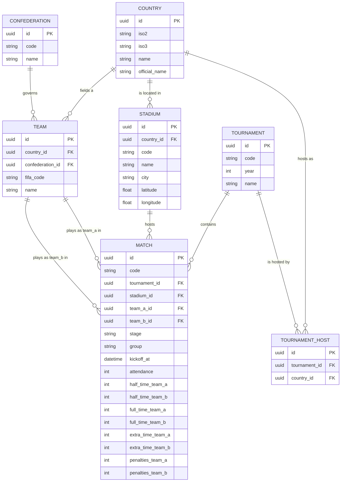
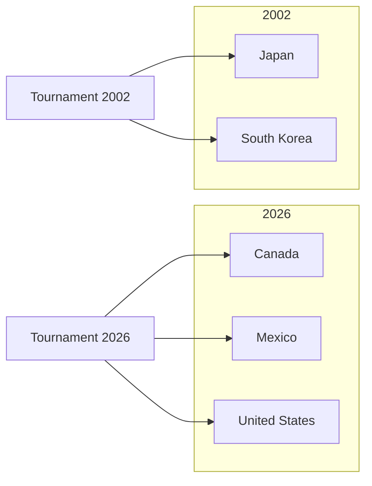
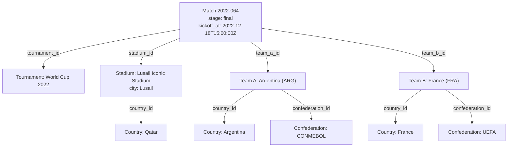

# Data model

This document describes every dataset in `data/`, the relationships between them, and the
reasoning behind the schema. For formatting and naming rules that apply across all of them, see
[CONVENTIONS.md](CONVENTIONS.md). For where each field's value comes from, see
[DATA_SOURCES.md](DATA_SOURCES.md).

## Overview

The data model is a normalized relational structure expressed as JSON files instead of database
tables. Seven entities, linked exclusively by UUID foreign keys — never a name, code, or other
natural key:

## Why normalize at all

The upstream source, OpenFootball, repeats team names, stadium names, and country references as
plain strings on every match record, with no stable identifier and several spellings for the same
real-world entity across different years (`Côte d'Ivoire` and `Ivory Coast`, `Bosnia-Herzegovina`
and `Bosnia & Herzegovina`, `USA`). That's fine for a human reading one tournament's fixture list; it
is a poor foundation for programmatic use — there is no reliable way to ask "how many World Cups has
this team played in" or "which matches were at this stadium" without re-parsing and re-matching
strings every time, and every consumer would have to solve the spelling-variant problem independently.

Normalizing into seven linked entities with permanent UUIDs means each real-world fact (a country, a
confederation, a team, a stadium, a tournament) is recorded exactly once, and every reference to it
is an explicit, typed foreign key that a program can follow without guessing. Renaming or correcting
a fact — like the `2022-046` stadium fix described in [DATASET_AUDIT.md](DATASET_AUDIT.md) — becomes
a single-field edit instead of a find-and-replace across hundreds of records.

## UUID usage

Every entity's primary key is a [UUID version 7](https://www.rfc-editor.org/rfc/rfc9562#name-uuid-version-7),
not an auto-incrementing integer and not a natural key (ISO code, FIFA code, year). Three reasons:

1. **Stability.** A natural key can change (a country's ISO code has, historically; a stadium's name
   changes with sponsorship). A UUID, once assigned, never has to.
2. **No coordination.** Countries, confederations, teams, stadiums, tournaments, tournament-hosts,
   and matches were generated in separate passes, sometimes re-run. Integer auto-increment IDs would
   require a shared counter or a database; UUIDs don't.
3. **Time-ordering.** UUID v7 embeds a millisecond timestamp in its first 48 bits, so IDs generated
   in the same batch sort in generation order — useful for debugging ("which records were created in
   this run") without needing a separate `created_at` column.

IDs are permanent: once a record has a UUID, later corrections to its other fields never touch the
`id`. See [CONVENTIONS.md](CONVENTIONS.md#identifiers).

## Entities

### `countries.json` — 70 records

One row per sovereign or historical entity referenced by at least one team. Not every country in the
world — only countries that have fielded a World Cup team in 2002–2026, or (for `Serbia and
Montenegro`) fielded one and no longer exists.

| Field | Type | Description |
|---|---|---|
| `id` | UUID v7 | Permanent identifier. |
| `iso2` | string | ISO 3166-1 alpha-2 code. |
| `iso3` | string | ISO 3166-1 alpha-3 code. |
| `name` | string | Common English name (`Russia`, not `Russian Federation`). |
| `official_name` | string | Official English name (`Russian Federation`). |

Sorted by `iso2` ascending. See [CONVENTIONS.md](CONVENTIONS.md#team-and-country-naming) for the
`name` vs `official_name` distinction and the historical-entity policy.

### `confederations.json` — 6 records

One row per FIFA confederation: AFC, CAF, CONCACAF, CONMEBOL, OFC, UEFA. A fixed, closed set — FIFA
has not added a seventh in its history, so this table is not expected to grow the way the others do.

| Field | Type | Description |
|---|---|---|
| `id` | UUID v7 | Permanent identifier. |
| `code` | string | FIFA's confederation acronym (`UEFA`, `CONCACAF`, ...). |
| `name` | string | Full English name (e.g. `Union of European Football Associations`). FIFA's own API returns these in French/Spanish for some confederations; this project uses the standard English name instead, the same policy as `countries.json`'s `official_name`. |

Sorted by `code` ascending.

### `teams.json` — 72 records

One row per national football team that has appeared in a World Cup in scope. A team is not the same
thing as a country — England, Scotland, and Wales are three teams sharing one country (`GB`).

| Field | Type | Description |
|---|---|---|
| `id` | UUID v7 | Permanent identifier. |
| `country_id` | UUID v7 (FK) | References `countries.json`. |
| `confederation_id` | UUID v7 (FK) | References `confederations.json`. A property of the team/association, not of the country — see below. |
| `fifa_code` | string | Official FIFA 3-letter team code. Not the same code space as `iso3` — see [CONVENTIONS.md](CONVENTIONS.md#country-codes). |
| `name` | string | The name actually used for the team (`United States`, `Ivory Coast`). |

Sorted by `fifa_code` ascending.

`confederation_id` is deliberately on `teams.json`, not `countries.json`: confederation membership
belongs to the national football association, not the sovereign state, and the model already treats
FIFA-association-level facts (like `fifa_code`) as team properties. Sourced from FIFA
(`GET /api/v3/teams/{IdTeam}`), since OpenFootball has no confederation data at all — see
[DATA_SOURCES.md](DATA_SOURCES.md).

### `stadiums.json` — 90 records

One row per stadium used across the 7 tournaments (74 for 2002–2022, 16 for 2026).

| Field | Type | Description |
|---|---|---|
| `id` | UUID v7 | Permanent identifier. |
| `country_id` | UUID v7 (FK) | References `countries.json`. |
| `code` | string | Lowercase ASCII slug of `name`, unique across the dataset (e.g. `kobe-wing-stadium`). |
| `name` | string | Stadium name as used at tournament time — see [CONVENTIONS.md](CONVENTIONS.md#stadium-naming-policy). |
| `city` | string | City or metro label as used at tournament time — see [CONVENTIONS.md](CONVENTIONS.md#city-naming-policy). |
| `latitude` | float | Decimal degrees, always 6 decimal places (e.g. `25.329640`). |
| `longitude` | float | Decimal degrees, always 6 decimal places. |

Sorted by `code` ascending.

### `tournaments.json` — 7 records

One row per FIFA World Cup edition in scope: 2002, 2006, 2010, 2014, 2018, 2022, 2026.

| Field | Type | Description |
|---|---|---|
| `id` | UUID v7 | Permanent identifier. |
| `code` | string | Four-digit year as a string, e.g. `"2002"`. |
| `year` | int | The same year, as a number, e.g. `2002`. |
| `name` | string | Exact top-level `name` from the corresponding OpenFootball `worldcup.json` (e.g. `"World Cup 2002"`). |

Sorted by `year` ascending. `code` and `year` are redundant by design: `code` is a stable string join
key for `matches[].code`'s `{year}-{number}` prefix, `year` is the typed field for range queries and
sorting.

### `tournament_hosts.json` — 10 records

A pure join table between `tournaments.json` and `countries.json`, one row per host country per
tournament. Most tournaments have one host; 2002 (Japan and South Korea) and 2026 (Canada, Mexico,
United States) have more than one.

| Field | Type | Description |
|---|---|---|
| `id` | UUID v7 | Permanent identifier. |
| `tournament_id` | UUID v7 (FK) | References `tournaments.json`. |
| `country_id` | UUID v7 (FK) | References `countries.json`. |

Sorted by tournament `year` ascending, then host country `name` ascending. Every tournament has at
least one row; a `(tournament_id, country_id)` pair never repeats.

### `data/matches/{year}.json` — 486 records across 7 files

The largest and most detailed dataset: one file per tournament (`2002.json` … `2026.json`), each
containing only that tournament's matches, together holding one row per World Cup match. Split by
tournament for the same reason the rest of the model is normalized — a consumer that only cares about
one World Cup shouldn't have to load or parse the other six.

| Field | Type | Description |
|---|---|---|
| `id` | UUID v7 | Permanent identifier. |
| `code` | string | `{year}-{FIFA official match number, zero-padded to 3 digits}`, e.g. `"2022-064"` (the final). Unique across the whole dataset, not just within a file. |
| `tournament_id` | UUID v7 (FK) | References `tournaments.json`. Always matches the file's own year — enforced by the test suite. |
| `stadium_id` | UUID v7 (FK) | References `stadiums.json`. |
| `team_a_id` / `team_b_id` | UUID v7 (FK) | Reference `teams.json`. Always two distinct teams. `team_a`/`team_b` preserve OpenFootball's `team1`/`team2` order; they are not "home"/"away" in any meaningful sense, since World Cup matches are played at neutral venues. |
| `stage` | enum string | One of `group_stage`, `round_of_32`, `round_of_16`, `quarter_final`, `semi_final`, `third_place`, `final`. Normalized from OpenFootball's inconsistent round labels (`"Quarterfinals"`, `"Quarter-finals"`, `"Quarter-final"` all become `quarter_final`). |
| `group` | string or `null` | Single letter, `A`–`L` (2002–2022 use `A`–`H`; 2026's 48-team/12-group format uses `A`–`L`). `null` for knockout-stage matches. |
| `kickoff_at` | ISO 8601 UTC string | See [DATA_SOURCES.md](DATA_SOURCES.md) — sourced from FIFA, not OpenFootball. |
| `attendance` | int | Official reported spectator count for the match. Always a plain positive integer, never estimated or backfilled — see [DATA_SOURCES.md](DATA_SOURCES.md) for sourcing. |
| `half_time_team_a` / `_b` | int or `null` | Score at half time. |
| `full_time_team_a` / `_b` | int or `null` | Score at the end of regulation (90 minutes). |
| `extra_time_team_a` / `_b` | int or `null` | Score at the end of extra time, only set if extra time was played. |
| `penalties_team_a` / `_b` | int or `null` | Penalty shootout score, only set if the match went to penalties. |

Sorted by tournament `year` ascending, then `kickoff_at` ascending, within each file (each file only
contains one year, so in practice this is just a `kickoff_at` sort per file).

**Two 2026 matches are intentionally absent**: the third-place play-off and the final. As of the
dataset snapshot, both OpenFootball and FIFA still record their participants as placeholders (`W101`,
`L101`, etc.) because the semi-finals had not yet produced finalists. No team can be assigned without
guessing, so the matches are omitted rather than filled with a guess — see
[CONVENTIONS.md](CONVENTIONS.md) and the match-generation history for the reasoning. 486 is therefore
64 × 6 (2002–2022) + 102 (2026's 104 scheduled matches minus these 2).

### `referees.json` — 147 records

One row per unique World Cup head referee across 2002–2026. Not yet linked to `data/matches/`: this
entity was introduced as its own milestone, deliberately scoped to the normalized referee list only.
A `referee_id` foreign key on match records — and the corresponding entry in the entity-relationship
diagram above — is planned as a separate, future milestone.

| Field | Type | Description |
|---|---|---|
| `id` | UUID v7 | Permanent identifier. Will be used as the FK target once matches reference referees. |
| `code` | string | Lowercase ASCII, hyphen-separated slug generated from `name`, unique across the dataset (e.g. `pierluigi-collina`). |
| `name` | string | Normalized referee name, with correct diacritics. |
| `association` | string | The football association the referee is affiliated with, as designated by FIFA — not necessarily an ISO country name (see [`referees-match-mapping.md`](referees-match-mapping.md) for why, e.g. the United Kingdom's four constituent associations). |

Sorted by `name` ascending. Built from
[`referees-match-mapping.md`](referees-match-mapping.md), the canonical, already-researched
match-by-match referee mapping — one row per unique `code` found there. One referee in that source,
Alireza Faghani, legitimately officiated under two different associations across tournaments (Iran
through 2022, Australia from 2026, following a real-world federation switch); since this dataset
holds exactly one row per person, his single `association` value here is his most recent one
(`Australia`), not a per-tournament history — see [DATA_SOURCES.md](DATA_SOURCES.md) for the full
sourcing.

## Cross-entity example

A single match ties every other entity together. Match `2022-064` (the 2022 final, Argentina v
France):

## What this model deliberately does not include

Some fields were considered and excluded because they can be derived from data already present, and
storing them separately would create a second source of truth that could drift out of sync:

- Tournament `start_date` / `end_date` — derivable as `min`/`max` of that tournament's `kickoff_at`.
- Match winner / runner-up — derivable from the final match's score.
- `teams_count`, `matches_count`, `stadiums_count` — derivable by counting related records.

None of these are stored anywhere in `data/`.
